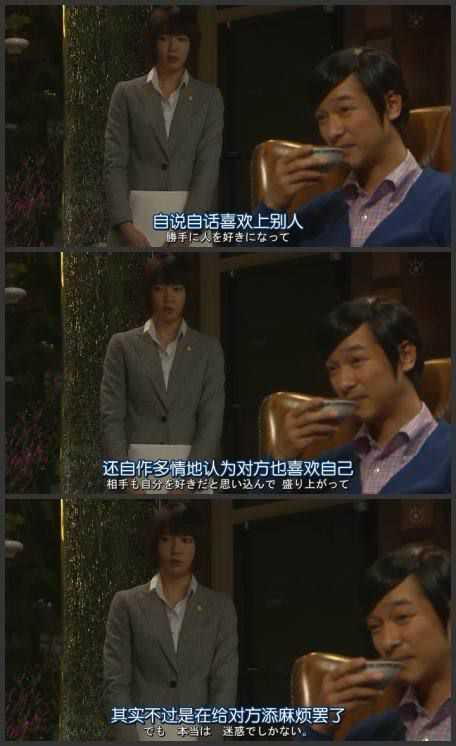

1. 好不容易上了岸，就别提海里的事了
2. 他只会记住他翻山越岭去找的人，不会记住翻山越岭找他的人
3. 他只会说你别老是不开心，但是永远不会想知道你为什么不开心，也不会想办法让你开心
4. 差点以为这辈子就是你了
5. 仅一夜之隔，我的心判若两人。
6. 表白失败的概率是70%，纹身会后悔的概率是80% ，分手后能复合的概率是83% ，但能走到最后的概率是3% ，异地恋会分手的概率是90% ，人会死得概率是100% 。所以，输了也别太难过，大家都是这样。
7. 我的满腔热血好像都燃尽了
8. 
```
“你会等他很久吗”
“不会”
“为什么”
“凭什么”.
```
9. 月亮没用，喜欢也没用
10. 我上了那么多年学，熬了那么多夜，做那么多习题，顶着各种各样的压力，参加各种残酷的考试，谈恋爱，分手，工作，加班。我这么辛苦，竟然是为了成为一个普通人
11.  


